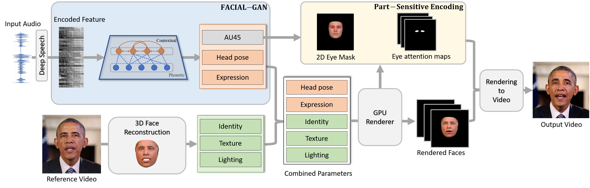

# FACIAL: Synthesizing Dynamic Talking Face with Implicit Attribute Learning


PyTorch implementation for the paper:


> **FACIAL: Synthesizing Dynamic Talking Face with Implicit Attribute Learning**
>
> Chenxu Zhang, 
> Yifan Zhao, 
> Yifei Huang, 
> Ming Zeng, 
> Saifeng Ni, 
> Madhukar Budagavi,
> Xiaohu Guo
>
> ICCV 2021
>
> [[Paper]](https://arxiv.org/abs/2108.07938) 
> [[Video]](https://www.youtube.com/watch?v=hl9ek3bUV1E) 
> [[Website]](https://personal.utdallas.edu/~xguo/) 


## Update: train a new person on Google Colab
[](https://colab.research.google.com/drive/1Z1tFPFf-O_HpaxshTqKM24TC_rrjR7Xc?usp=sharing)


## Run the test demo on Google Colab 
[](https://colab.research.google.com/drive/1iQiQeFAPoQ0jO1dstPHJDvaTJRV9uE9O)


## Requirements
- Python environment 
```
conda create -n audio_face
conda activate audio_face
```
- ffmpeg
```
sudo apt-get install ffmpeg
```
- python packages
```
pip install -r requirements.txt
```
- you may add opencv by conda.
```
conda install opencv
```

## Citation
```
@inproceedings{zhang2021facial,
  title={FACIAL: Synthesizing Dynamic Talking Face with Implicit Attribute Learning},
  author={Zhang, Chenxu and Zhao, Yifan and Huang, Yifei and Zeng, Ming and Ni, Saifeng and Budagavi, Madhukar and Guo, Xiaohu},
  booktitle={Proceedings of the IEEE/CVF International Conference on Computer Vision (ICCV)},
  pages={3867--3876},
  year={2021}
}
```

## Acknowledgments
We use [Deep3DFaceReconstruction](https://github.com/microsoft/Deep3DFaceReconstructionh) for face reconstruction, [DeepSpeech](https://github.com/mozilla/DeepSpeech) and [VOCA](https://github.com/TimoBolkart/voca) for audio feature extraction, and [3dface](https://github.com/YadiraF/face3d) for face rendering. Rendering-to-video module borrows heavily from [everybody-dance-now](https://github.com/Lotayou/everybody_dance_now_pytorch). 

